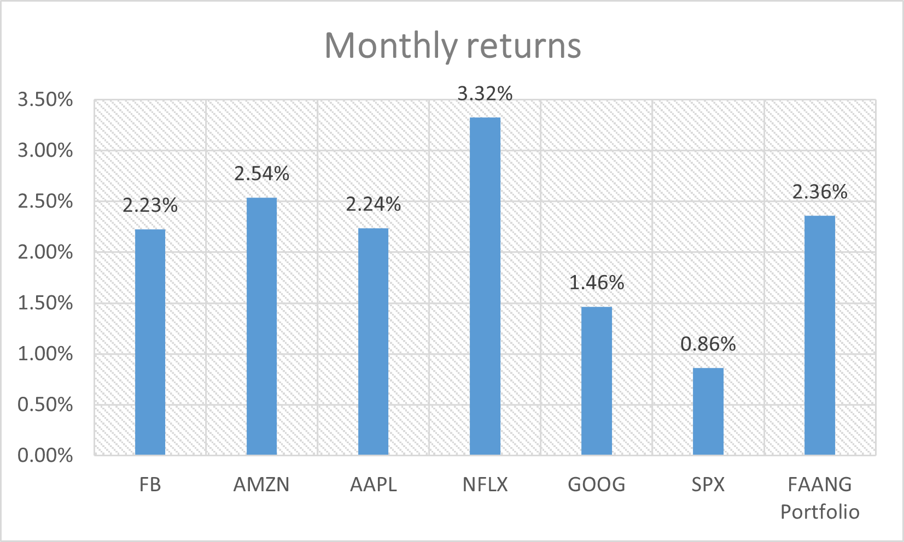
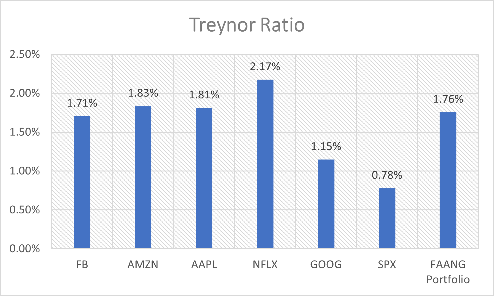
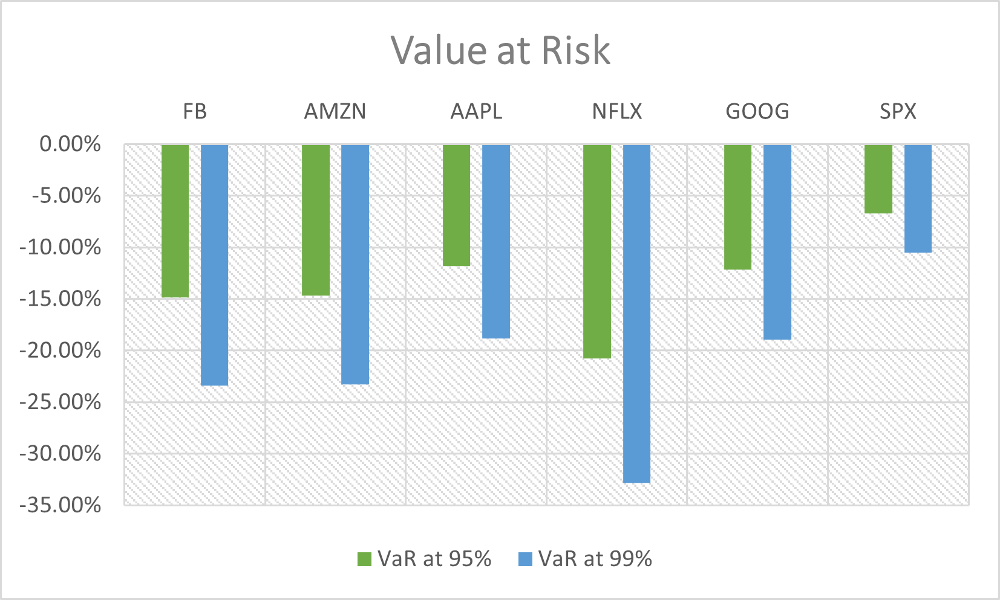

# FAANG Quantitative Risk Model

A quantitative finance project evaluating the risk and performance of a FAANG portfolio (Meta/Facebook, Amazon, Apple, Netflix, Google) compared to the S&P 500 (SPX). This project leverages daily price data to compute key financial metrics, including returns, volatility, Beta, Treynor Ratio, and Value at Risk (VaR), providing insights into the portfolio's risk-return dynamics.

## Project Overview

This project analyzes the historical performance and risk of FAANG stocks and a hypothetical equal-weighted FAANG portfolio against the S&P 500. By calculating key financial metrics, it assesses the trade-offs between returns and risk, offering valuable insights for investors and portfolio managers.

- **Data**: Daily price data (Open, High, Low, Close, Adjusted Close, Volume, Daily Returns) for FAANG stocks (e.g., Meta/FB from Jan-Feb 2014) and SPX.
- **Methodology**: 
  - Performance metrics: Monthly and average daily returns.
  - Risk metrics: Standard Deviation, Value at Risk (VaR) at 95% and 99% confidence levels.
  - Risk-adjusted metrics: Beta and Treynor Ratio.
- **Portfolio**: Equal-weighted FAANG portfolio for comparative analysis.

## Repository Contents

- [**`FAANG_Risk_Model.xlsx`**](./FAANG_Risk_Model.xlsx): Excel file containing raw price data, calculated metrics, and visualizations for FAANG stocks and SPX.

## Key Findings

1. **Netflix (NFLX) Outperformance**:
   - Highest monthly return (3.32%) and average daily return (0.16%).
   - Highest risk with a standard deviation of 12.06% and VaR (99%) of -32.86%.
   - High market sensitivity (Beta: 1.49), indicating amplified exposure to market movements.

2. **Google (GOOG) Stability**:
   - Lowest monthly return (1.46%) and risk-adjusted performance (Treynor: 1.20%).
   - Lowest volatility among FAANG stocks (Std Dev: 6.80%), making it the most stable.

3. **FAANG Portfolio vs. S&P 500**:
   - FAANG portfolio outperforms SPX with a monthly return of 2.36% (vs. 0.86% for SPX).
   - Moderate systematic risk (Beta: 1.30) and superior risk-adjusted return (Treynor: 1.76% vs. 0.78% for SPX).

4. **Market Sensitivity**:
   - NFLX and AMZN exhibit high market sensitivity (Beta: 1.49 and 1.34, respectively).
   - AAPL is the least sensitive (Beta: 1.19), indicating lower correlation with market trends.

## Visualizations

The project includes visualizations to illustrate key metrics, created using Excel:

- **Monthly Returns**: Bar chart comparing monthly returns of FAANG stocks, the portfolio, and SPX.  
  

- **Standard Deviation**: Visualizes volatility across FAANG stocks and SPX.  
  

- **Treynor Ratio**: Highlights risk-adjusted performance (return per unit of systematic risk).  
  

- **Value at Risk (VaR)**: Displays downside risk at 95% and 99% confidence levels.  
  

- **Beta**: Bar chart comparing market sensitivity (Beta) of FAANG stocks, the portfolio, and SPX.  
  

> **Note**: Visualization files are placeholders. Ensure they are uploaded to the repository and linked correctly.

## Skills Demonstrated

- **Quantitative Finance**: Calculated and interpreted financial metrics like returns, volatility, Beta, and Treynor Ratio.
- **Risk Management**: Assessed downside risk using VaR at multiple confidence levels.
- **Financial Modeling**: Built models to analyze portfolio performance and risk in Excel.
- **Data Visualization**: Created clear, insightful charts to communicate findings.
- **Version Control**: Hosted and documented the project on GitHub for collaboration and reproducibility.

## Tools Used

- **Excel**: Data analysis, financial calculations, and visualization.
- **GitHub**: Project hosting, version control, and documentation.

## How to Use

1. **Clone the Repository**:
   ```bash
   git clone https://github.com/your-username/FAANG-Quant-Risk-Model.git
